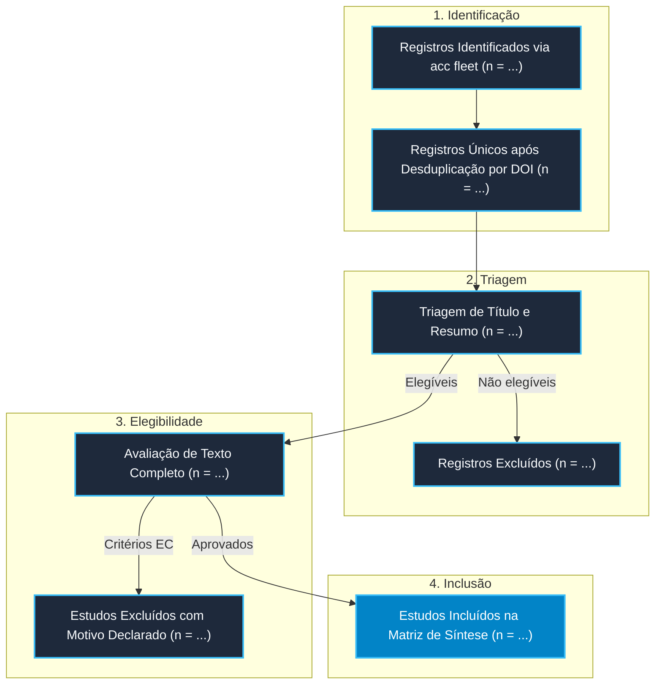

# 📋 Protocolo de Revisão Sistemática: Modelos de Linguagem Multimodais para Extracao de Documentos

**Autor Principal:** Pesquisador  
**Data de Registro do Protocolo:** 30/09/2026  
**Framework de Escopo:** `PICO` (Diretrizes PRISMA-P & SALSA)  
**Status:** `Em Execução (Congelado pré-coleta para controle de viés)`  

---

## 1. Justificativa & Contextualização Teórica
*Descreva brevemente a lacuna científica fundamentada no modelo de deficiências da literatura (Creswell, 2022; Wayne Booth, 2024).*

---

## 2. Pergunta Central de Pesquisa (PICO)
> **Pergunta:** Como [Intervenção/Fenômeno] afeta [População/Contexto] em comparação a [Controle] quanto a [Desfecho]?

| Elemento PICO | Descrição Operacional |
|---|---|
| **P (População/Problema)** | Definir a população-alvo, corpus ou contexto tecnológico |
| **I (Intervenção)** | Modelo, método, técnica ou intervenção avaliada |
| **C (Comparação)** | Linha de base (baseline), abordagem tradicional ou controle |
| **O (Desfecho/Outcome)** | Métricas primárias (ex: acurácia, latência, fidedignidade, custo) |


---

## 3. Critérios Formais de Elegibilidade

| Critérios de Inclusão (IC) | Critérios de Exclusão (EC) |
|---|---|
| **IC1:** Artigos publicados em periódicos ou anais de conferências revisados por pares. | **EC1:** Artigos sem texto completo disponível ou resumo inacessível. |
| **IC2:** Estudos que apresentem dados empíricos ou validação formal de artefato. | **EC2:** Artigos de opinião, cartas ao editor ou tutoriais sem metodologia. |
| **IC3:** Publicações no intervalo temporal de [2020 - 2026]. | **EC3:** Estudos fora do escopo ou que não utilizem as métricas definidas no PICO. |
| **IC4:** Idiomas: Inglês e Português. | **EC4:** Estudos duplicados ou versões anteriores de mesmo preprint. |

---

## 4. Fontes de Informação & Estratégia de Busca
A coleta deve ser executada de forma concorrente através da mini-frota `acc fleet`:

- **Bases Científicas Primárias:** arXiv, OpenAlex, CrossRef, Semantic Scholar, Consensus.app.
- **String Booleana Padronizada:**
  ```text
  ("termo_principal" OR "sinonimo_1") AND ("metodo_ou_modelo") AND ("desfecho_alvo")
  ```

---

## 5. Fluxo de Seleção e Triagem (PRISMA 2020)



---

## 6. Procedimento de Extração de Dados e Avaliação de Qualidade
Os artigos aprovados na Fase 3 devem ser transferidos para a matriz de dados:
- Ferramenta de Extração: `acc matrix <arquivo_fleet_ou_termo>`
- Instrumento de Avaliação Crítica: CASP Checklist / RoB 2 / MMAT.

